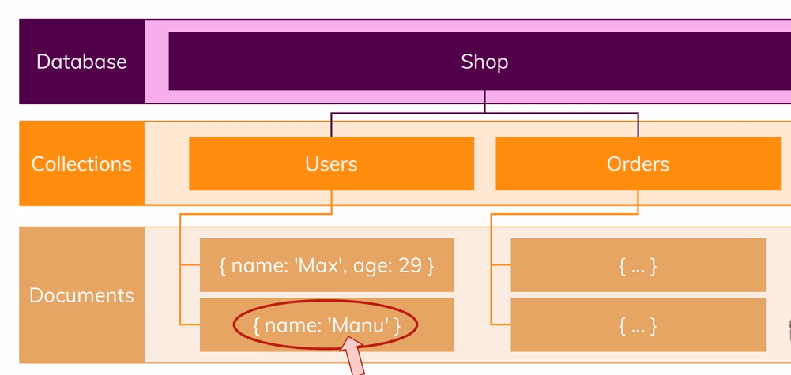
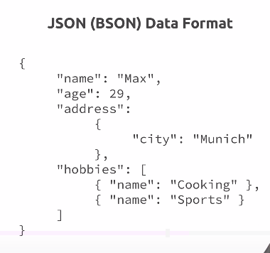

MongoDB is database and company behind this is also name as MongoDB. Now the name is stemming from the word humongous because this database is built to store lots and lots of data and not just from a
data size perspective but also in a sense of you can store lots of
data and you can then work with it efficiently which of course also is super important,

It is really all about flexibility, where SQL based databases are very strict about the data you
have to store in there, mongodb is more flexible,
you can store totally different data in one and the same collection and therefore, your database can
grow with your application and your application needs

Now inside a document as I mentioned, you use these javascript objects to store your data, to be precise, you use a format called json and this is how a document would look like. In json, a
single document is surrounded by these curly braces.
Now in title it also says bson instead of json,
well behind the scenes on the server, mongodb converts your json data which is this format you
see here to a binary version of it which can basically be stored and can queried more efficiently,