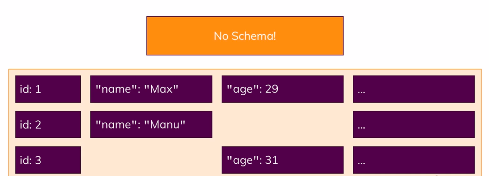

MongoDB is database and company behind this is also name as MongoDB. Now the name is stemming from the word humongous because this database is built to store lots and lots of data and not just from a
data size perspective but also in a sense of you can store lots of
data and you can then work with it efficiently which of course also is super important,

It is really all about flexibility, where SQL based databases are very strict about the data you
have to store in there, mongodb is more flexible,
you can store totally different data in one and the same collection and therefore, your database can
grow with your application and your application needs

Now inside a document as I mentioned, you use these javascript objects to store your data, to be precise, you use a format called json and this is how a document would look like. In json, a
single document is surrounded by these curly braces.
Now in title it also says bson instead of json,
well behind the scenes on the server, mongodb converts your json data which is this format you
see here to a binary version of it which can basically be stored and can queried more efficiently,

There was one thing which I found kind of hard to wrap my head around. Mongodb is a so-called noSQL
solution because it's basically following an opposite concept or philosophy than all the SQL based databases do. Instead of normalizing data which means storing it, distribute it across multiple tables where every table has a clear schema and then using a lot of relations, instead
of doing that, mongodb goes for storing data together in a document and it also doesn't force a schema on you.

This is where the efficiency is derived from. Since data is stored together, when your application is fetching data, it doesn't need to reach out to collection A, merge it with
collection B, merge it with collection C, instead it goes to collection A then mongodb has a very efficient querying mechanism behind the scenes so that it can go through all the data very fast when looking for a specific document, so this will be super fast and then it finds that document and it's done, It doesn't need to do any merging most of the time. So this is really where the speed, the performance and flexibility comes from.

