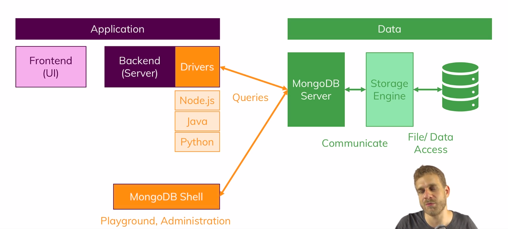
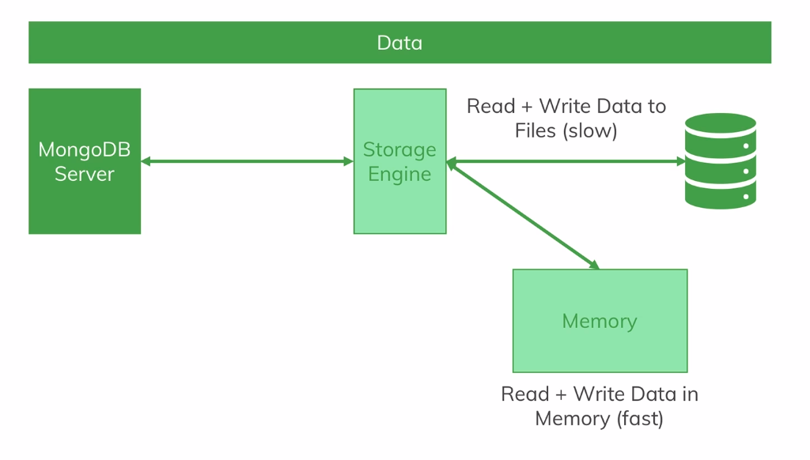

Now the mongodb server will actually not directly write the data into files but talk to a so-called storage engine which you could replace with your favorite storage engine but the default one called Wired Tiger is actually an awesome storage engine which allows you to efficiently work with your data, store it efficiently and so on. So the mongodb basically gets the query from your driver or from your shell and then just knows I want to insert something and basically forwards that information after doing some other things to the storage engine and the storage engine then stores it in files in the end.

Now if we have a closer look at that data layer with the server, the storage engine and the file system, then we actually have to differentiate between writing and reading from files which is a bit slower and writing and reading from memory which is faster. The storage engine actually does both,
it loads a chunk of data into memory and manages that such that the data you often use is in memory of
possible, it also writes data in memory at first so that this is really fast
but then of course it also goes ahead and stores data in the database files and I will dive a little
deeper into that later in the course but in general, you need to be aware that you always talk to the mongodb server and behind that server, the server talks to the storage engine which manages your data and stores it in files in the end but also in memory in between so that you can work with the data in a very fast way.