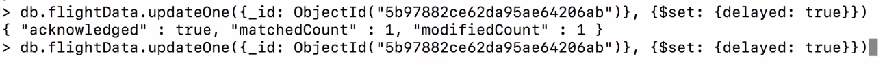
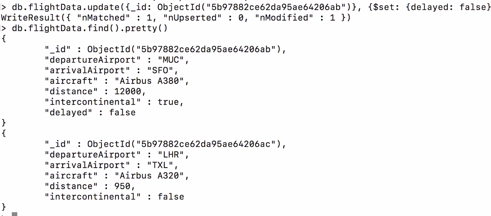
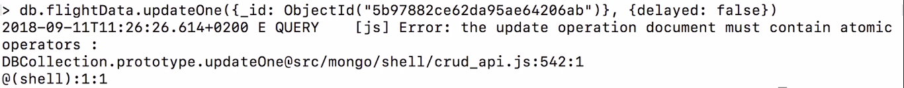
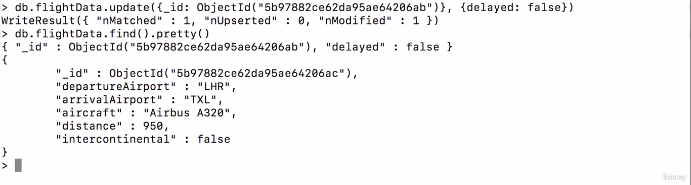
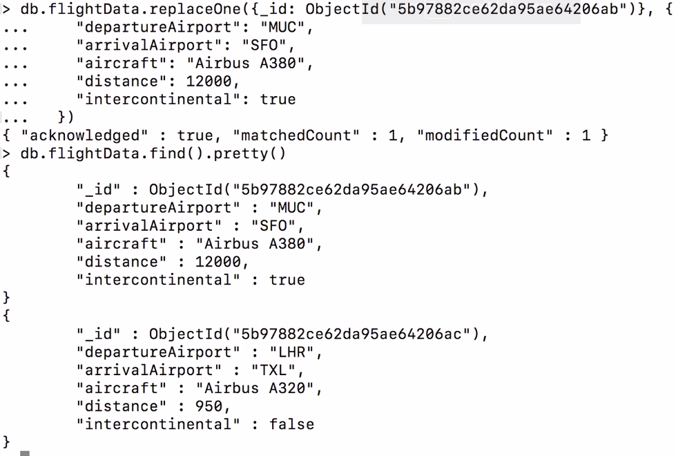

In updateOne we can not send data as document to update the field.
It will throw the error.

Difference between update and updateOne is update replace the old data with new data
whereas updateOne or updateMany only affects the field which will be written in 
updating data.

replaceOne is same as update but with only one document at a time.