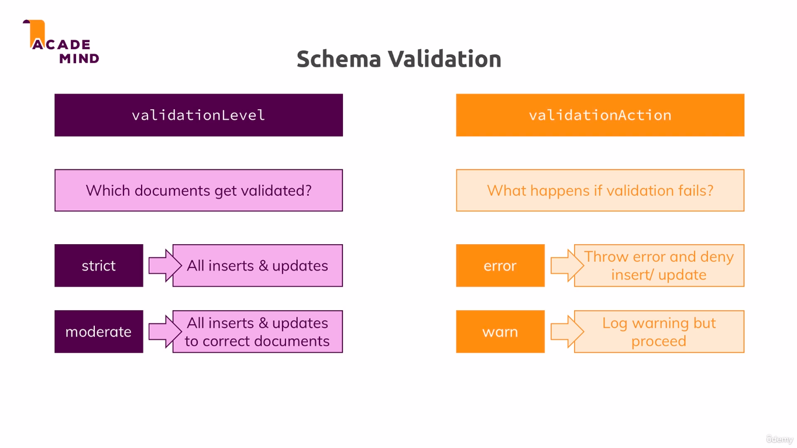

# Add validation
db.createCollection('posts', {
  validator: {
    $jsonSchema: {
      bsonType: 'object',
      required: ['title', 'text', 'creator', 'comments'],
      properties: {
        title: {
          bsonType: 'string',
          description: 'must be a string and is required'
        },
        text: {
          bsonType: 'string',
          description: 'must be a string and is required'
        },
        creator: {
          bsonType: 'objectId',
          description: 'must be an objectid and is required'
        },
        comments: {
          bsonType: 'array',
          description: 'must be an array and is required',
          items: {
            bsonType: 'object',
            required: ['text', 'author'],
            properties: {
              text: {
                bsonType: 'string',
                description: 'must be a string and is required'
              },
              author: {
                bsonType: 'objectId',
                description: 'must be an objectid and is required'
              }
            }
          }
        }
      }
    }
  }
});

# validation modification
db.runCommand({
  collMod: 'posts',
  validator: {
    $jsonSchema: {
      bsonType: 'object',
      required: ['title', 'text', 'creator', 'comments'],
      properties: {
        title: {
          bsonType: 'string',
          description: 'must be a string and is required'
        },
        text: {
          bsonType: 'string',
          description: 'must be a string and is required'
        },
        creator: {
          bsonType: 'objectId',
          description: 'must be an objectid and is required'
        },
        comments: {
          bsonType: 'array',
          description: 'must be an array and is required',
          items: {
            bsonType: 'object',
            required: ['text', 'author'],
            properties: {
              text: {
                bsonType: 'string',
                description: 'must be a string and is required'
              },
              author: {
                bsonType: 'objectId',
                description: 'must be an objectid and is required'
              }
            }
          }
        }
      }
    }
  },
  validationAction: 'warn'
});

here validationAction is warn and it will show in mongodb log when you send something wring