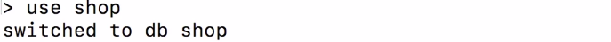
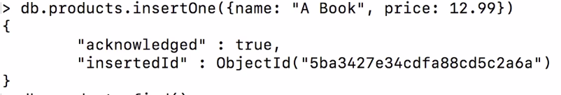
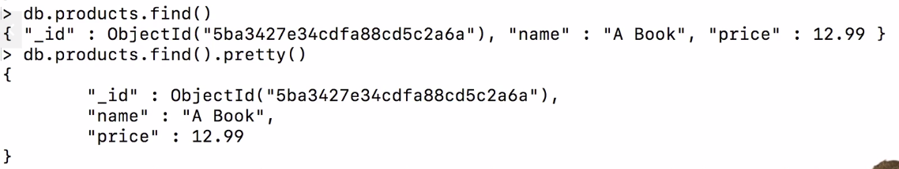

mongosh uri cmd ===> help us to connect with given uri mongodb. If there is not uri then it will connect to
local mongodb

show dbs cmd ===> This will show all database which is currently existing.

use dbname cmd ===> This will switch on the given name db still it is not existing. It will create after creating collection.

db.products.insertOne({}) cmd ===> It will create a document inside collection of products on that db.
and in return it will give us autogenerated id and acknowledgement.

db.products.find() cmd  ===> It will give you back all result in group of 10 documents.

