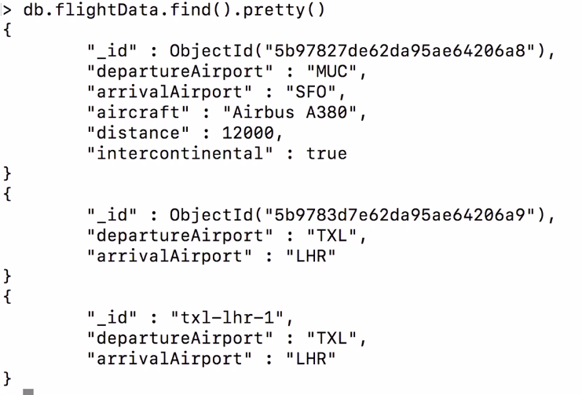
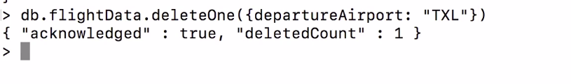
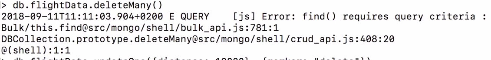
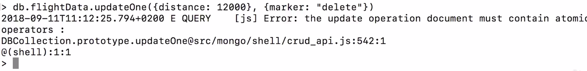
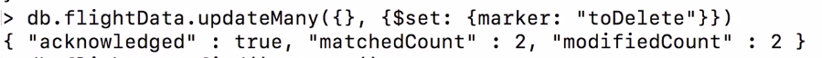

here the error us because we haven't pass anything. If you pass an empty curly brackets
it will select all document.

here this gave error because, 
The thing is it simply is an incorrect type of data for updating, you don't pass in a document describing your change like this because Mongodb doesn't know how to interpret
this, instead what you do pass here is a document with curly braces with a special keyword, $set
and this is something you can remember, whenever you see something with dollar sign in mongodb, it's
a reserved operator or word, $set is simply identified by mongodb when used in the update one operation to describe the changes you want to make.
The value of $set then is a document with curly braces and we need to close another pair
of curly braces for our surrounding curly braces now marked in purple and now what this does is it tells mongodb hey for this document you're finding, please set this value and if this value did exist, it would change it.

here with set operator you will update or add key in document