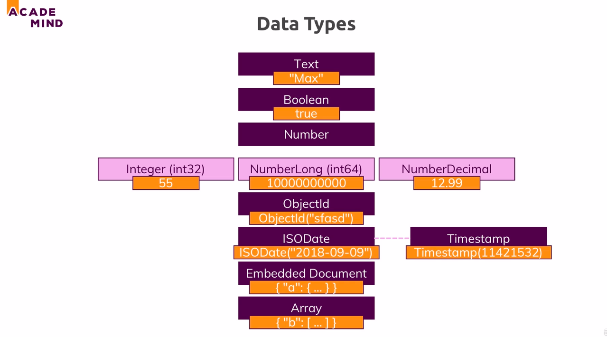

Data Types which are used my mongodb.

Data Types & Limits
MongoDB has a couple of hard limits - most importantly, a single document in a collection (including all embedded documents it might have) must be <= 16mb. Additionally, you may only have 100 levels of embedded documents.

You can find all limits (in great detail) here: https://docs.mongodb.com/manual/reference/limits/

For the data types, MongoDB supports, you find a detailed overview on this page: https://docs.mongodb.com/manual/reference/bson-types/

Important data type limits are:

Normal integers (int32) can hold a maximum value of +-2,147,483,647

Long integers (int64) can hold a maximum value of +-9,223,372,036,854,775,807

Text can be as long as you want - the limit is the 16mb restriction for the overall document

It's also important to understand the difference between int32 (NumberInt), int64 (NumberLong) and a normal number as you can enter it in the shell. The same goes for a normal double and NumberDecimal.

NumberInt creates a int32 value => NumberInt(55)

NumberLong creates a int64 value => NumberLong(7489729384792)

If you just use a number (e.g. insertOne({a: 1}), this will get added as a normal double into the database. The reason for this is that the shell is based on JS which only knows float/ double values and doesn't differ between integers and floats.

NumberDecimal creates a high-precision double value => NumberDecimal("12.99") => This can be helpful for cases where you need (many) exact decimal places for calculations.

When not working with the shell but a MongoDB driver for your app programming language (e.g. PHP, .NET, Node.js, ...), you can use the driver to create these specific numbers.

Example for Node.js: http://mongodb.github.io/node-mongodb-native/3.1/api/Long.html

This will allow you to build a NumberLong value like this:

const Long = require('mongodb').Long;
 
db.collection('wealth').insert( {
    value: Long.fromString("121949898291")
});
By browsing the API docs for the driver you're using, you'll be able to identify the methods for building int32s, int64s etc.